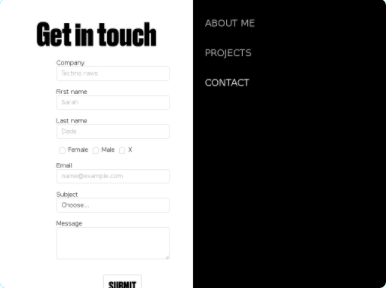

# form_challenge

  
## About  the project

The main purpose was to set up a form that allow potential recruiters to contact me by using PHPMailer

**link:** [Form_challenge](https://sarah-dade.dev/)

##  objectives  

* Project planning
* Mock-up creation
* semantical HTML
* accessibility in HTML
* Sass
* Framework CSS or not (bootstrap, bulma, tailwind, ............. )
* Progressive enhancement
* PHP programming
* Good readme

---  
  
##  work organization  

   To achieve thoses objectives, i first drew few mock-up with Adobe XD, which gave me an overlook of the design structure.
   Then i did some code in Html / Sass to launch the Webpage, afterwards i wrote the PHP code to get the entered informations.
   For the last part of the project i had to configure PHPMailer and make it work.  It was the most challenging part for me, as the SMTP could not work with my host. 
   

         
